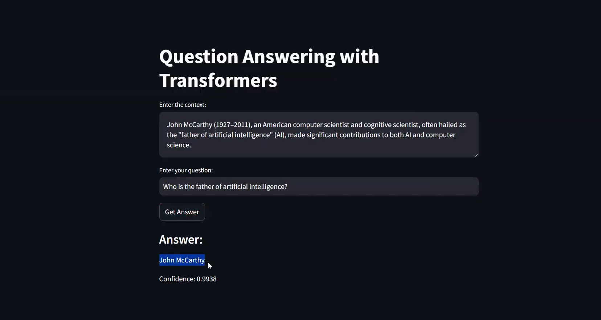

# Fine-Tuning BERT for Question Answering

This project focuses on fine-tuning a BERT-based model for question answering tasks, leveraging the Stanford Question Answering Dataset (SQuAD) and the Hugging Face Transformers library. The solution includes a fine-tuned model and a user-friendly Streamlit web application for interactive question answering.

### Demo

See a live demonstration of the Question Answering application:

[](https://drive.google.com/file/d/1kU9Kz7VBG4HRDP8LTKcAVk8t3QcK-AIv/view?usp=sharing)

*Click the image above to watch the demo video.*

### Features
* **BERT Model Fine-tuning**: Fine-tuned `google-bert/bert-base-uncased` model on the SQuAD dataset.
* **Data Preprocessing**: Implemented custom functions to tokenize questions and contexts, align tokenized data with answer spans, and handle overflowing tokens.
* **Interactive Web Application**: Developed a Streamlit application for real-time question answering using the fine-tuned model.
* **Performance Evaluation**: Evaluated the model's performance using Exact Match (EM) and F1 Score metrics.

### Methodology and Steps Taken
The fine-tuning process involved the following key steps:
1.  **Importing Libraries**: Utilized `evaluate`, `datasets`, and `transformers` libraries.
2.  **Loading Data**: Loaded the SQuAD dataset (`rajpurkar/squad`), which includes 87,599 training samples and 10,570 validation samples.
3.  **Data Preprocessing**: Tokenized questions and contexts using the BERT tokenizer, aligned tokenized data with answer spans, and stored start/end positions of answers.
4.  **Model Fine-Tuning**: Fine-tuned the `bert-base-uncased` model using the `Trainer` API from the `transformers` library, defining essential parameters like learning rate, batch size, and epochs.
5.  **Saving the Model**: The trained model was saved for later inference.

### Experimentation Details
* **Hyperparameters**:
    * Learning Rate: 3e-5
    * Batch Size: 16
    * Epochs: 2
    * Weight Decay: 0.01
* **Challenges Encountered**:
    * **Memory Consumption**: Fine-tuning large transformer models required high GPU memory, leading to consideration of optimization techniques like gradient accumulation.
    * **Slow Training Speed**: Fine-tuning was time-consuming due to the large dataset and model size; batch size adjustments helped manage computational efficiency.

### Evaluation Results
The model was evaluated on the validation set, achieving:
* **Exact Match (EM)**: 80.3%
* **F1 Score**: 89.7%
These results indicate strong performance in answer extraction accuracy.

### Technologies Used
* Python
* Hugging Face Transformers
* PyTorch
* Streamlit
* Datasets (Hugging Face)
* Evaluate (Hugging Face)
* BERT (Bidirectional Encoder Representations from Transformers)
* Jupyter Notebook

### Setup and Installation

1.  **Clone the repository (if applicable):**
    ```bash
    git clone <repository_url>
    cd <repository_name>
    ```
2.  **Install dependencies:**
    ```bash
    pip install transformers datasets evaluate streamlit torch
    ```
    *(Note: Additional dependencies might be required based on the environment setup in the Jupyter notebook.)*
3.  **Download the SQuAD dataset and pre-trained BERT model:**
    The dataset and model are automatically downloaded by the scripts using `load_dataset("rajpurkar/squad")` and `AutoTokenizer.from_pretrained("google-bert/bert-base-uncased")`, `AutoModelForQuestionAnswering.from_pretrained("google-bert/bert-base-uncased")`.

### Usage

**1. Fine-tuning the BERT Model:**
    Run the `finetune-bert-for-question-answering.ipynb` Jupyter Notebook to preprocess the data, fine-tune the BERT model, and save the trained model.

**2. Running the Streamlit Application:**
    After the model is saved to `./saved_model` (as referenced in `app.py`), you can run the Streamlit application:
    ```bash
    streamlit run app.py
    ```
    This will open a web interface where you can input a context and a question to get an answer from the fine-tuned BERT model.
